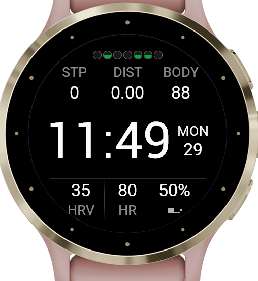
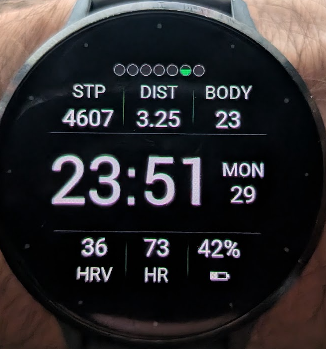

#  Minimalist Watch Face for round-screen Garmin watches

Hey, my name is Ilker and this is my watch face. I've always loved uncluttered watch faces that just give me the right data — nothing more, nothing less. Feel free to customize it and make it your own.

---

A minimalist, AMOLED-optimised watch face for the **Garmin Venu 3S** built with the Connect IQ SDK. Pure black background, white data, surgical layout — everything you need at a glance, nothing you don't.

## Install on your watch (no coding required)

You need a **Garmin Venu 3S**. No computer tools, no accounts — just a USB cable.

**Step 1 — Download the file**

Download [`venu3swatchface.prg`](venu3swatchface.prg) from this page.
(Click the filename → click the download button in the top-right corner of the file preview.)

**Step 2 — Connect your watch**

Plug your Venu 3S into your computer with its USB charging cable. Your watch will appear as a drive — like a USB stick — in Finder (Mac) or File Explorer (Windows).

**Step 3 — Copy the file**

Open the watch drive and navigate to:
```
GARMIN → Apps
```
Drag `venu3swatchface.prg` into that folder.

**Step 4 — Eject and select**

Safely eject the watch, then on the watch go to:
**Settings → Watch Face** (or long-press the current watch face) and pick **Tactical Grid**.

That's it.

---

## Screenshots

| Simulator | On the Wrist |
|:---------:|:------------:|
|  |  |

## Features

### Health dot row (top)
Seven dots — one per day, today on the right — give you a week-at-a-glance health summary without numbers.

- **Top half** — Resting heart rate colour: green `< 57 bpm` · yellow `57–59` · red `≥ 60`
- **Bottom half** — Green when the day's step goal was met, or ≥ 5 vigorous / ≥ 20 moderate active minutes logged

> **Two things to know about the RHR dot colours:**
> - **Fills in over time.** The watch records each day's RHR locally as you wear it. Past dots have no colour on a fresh install and gain colour going forward — expect a full week of colour after about seven days of wear.
> - **Approximation.** The value used is Garmin's `averageRestingHeartRate` (a rolling average), not the exact per-night RHR shown in the Garmin app. It's close, but not identical.

### Top metrics
| Left | Centre | Right |
|------|--------|-------|
| STP — steps | DIST — distance (km or mi) | BODY — body battery (0–100) |

Slim fading vertical dividers separate each column.

### Time band (centre)
Large time display (`FONT_NUMBER_THAI_HOT`) with a stacked date block (weekday + day of month) aligned to the right. Font size is auto-selected so the full layout always fits inside the round bezel.

### Bottom metrics
| Left | Centre | Right |
|------|--------|-------|
| Sleep score (or HRV stress fallback) + moon icon | HR — current heart rate | Battery % + icon |

### Always-On Display (AOD)
Dimmed time + date only, with per-minute pixel shift for burn-in protection.

## Design principles

- **Pure black background** — AMOLED pixel-off efficiency
- **Circle-aware layout** — chord formula ensures no element clips the round bezel
- **Graceful fallbacks** — every metric degrades to `--` rather than crashing
- **Strict type safety** — compiled with `monkeyC.typeCheckLevel: Strict`

## Supported devices

All 59 round-screen Garmin watches with Connect IQ API 5.0+. The layout is fully dynamic — it adapts to any screen size from 208×208 to 454×454. Graceful fallbacks mean features like body battery, sleep score, and HRV simply show `--` on watches that don't have the relevant sensors.

| Family | Models |
|--------|--------|
| **Venu** | Venu® 2, 2 Plus, 2S · Venu® 3, 3S · Venu® 4 41mm, 4 45mm · vívoactive® 5, 6 |
| **Forerunner** | 165, 165 Music · 170, 170 Music · 255, 255 Music, 255s, 255s Music · 265, 265s · 570 42mm, 570 47mm · 70 · 955, 965, 970 |
| **fēnix** | 7, 7 Pro, 7 Pro Solar · 7S, 7S Pro · 7X, 7X Pro, 7X Pro Solar · 8 43mm · 8 47mm/51mm · 8 Pro · 8 Solar 47mm, 8 Solar 51mm · E |
| **epix** | epix (Gen 2) · epix Pro 42mm, 47mm, 51mm |
| **MARQ** | MARQ (Gen 2) · MARQ (Gen 2) Aviator |
| **D2** | D2 Air X10 · D2 Mach 1, Mach 2, Mach 2 Pro |
| **Instinct** | Instinct 3 AMOLED 45mm, 50mm · Instinct Crossover AMOLED |
| **Approach** | Approach S50 · S70 42mm, S70 47mm |
| **Descent** | Descent G2 · Mk3 43mm, Mk3i 51mm |
| **Enduro** | Enduro 3 |

> Devices with API level below 5.0 (fēnix 5/6, Forerunner 245/745, vivoactive 3/4, older Venu/MARQ) are excluded — they predate the API features this face relies on.

## Build requirements

| Item | Version |
|------|---------|
| Connect IQ SDK | 9.2.0+ |
| Min API level | 4.0.0 |

### Permissions used
- `SensorHistory` — body battery, HRV/stress
- `ComplicationSubscriber` — sleep score
- `UserProfile` — resting heart rate for dot colours

## Building

1. Install the [Connect IQ SDK](https://developer.garmin.com/connect-iq/sdk/) and set `SDK` in `run.sh` to your SDK path.
2. Generate a developer key:
   ```
   openssl genrsa -out developer_key 4096
   openssl pkcs8 -topk8 -inform PEM -outform DER -in developer_key -out developer_key -nocrypt
   ```
3. Build and launch the simulator:
   ```
   bash run.sh
   ```
4. To sideload directly, copy `bin/venu3swatchface.prg` to `GARMIN/Apps/` on the watch.

## Project structure

```
├── manifest.xml              # App manifest (permissions, target device)
├── monkey.jungle             # Build descriptor
├── run.sh                    # Build + simulator launch script
├── source/
│   ├── WatchFaceApp.mc       # App entry point
│   └── WatchFaceView.mc      # All rendering logic
└── resources/
    ├── drawables/            # Launcher icon + drawables.xml
    └── strings/              # App name string
```

## License

MIT — do whatever you want with it, attribution appreciated.
