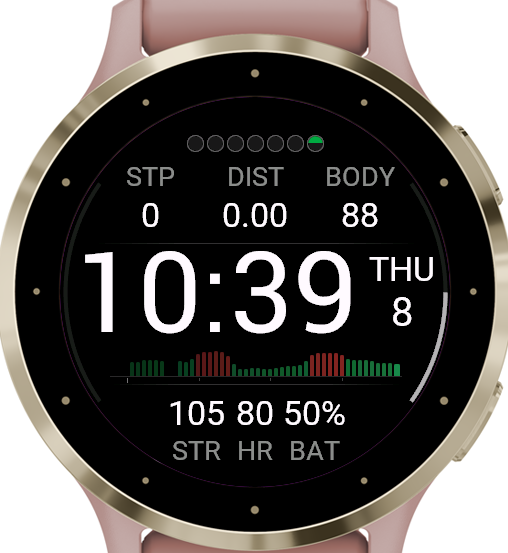
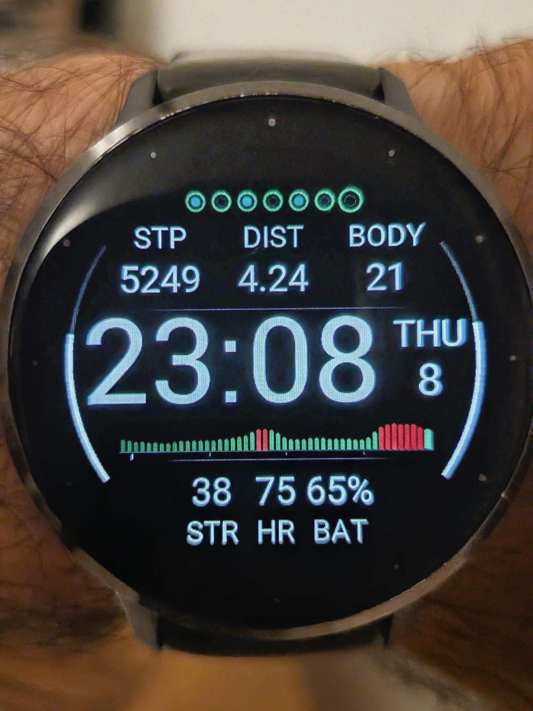

#  Minimalist Watch Face for round-screen Garmin watches

Hey, my name is Ilker and this is my watch face. I've always loved uncluttered watch faces that just give me the right data — nothing more, nothing less. Feel free to customize it and make it your own.

---

A minimalist, AMOLED-optimised watch face for the **Garmin Venu 3S** built with the Connect IQ SDK. Pure black background, white data, surgical layout — everything you need at a glance, nothing you don't.

## Install on your watch (no coding required)

You need a **Garmin Venu 3S**. No computer tools, no accounts — just a USB cable.

**Step 1 — Download the file**

Download [`venu3swatchface.prg`](venu3swatchface.prg) from this page.
(Click the filename → click the download button in the top-right corner of the file preview.)

**Step 2 — Connect your watch**

Plug your Venu 3S into your computer with its USB charging cable. Your watch will appear as a drive — like a USB stick — in Finder (Mac) or File Explorer (Windows).

**Step 3 — Copy the file**

Open the watch drive and navigate to:
```
GARMIN → Apps
```
Drag `venu3swatchface.prg` into that folder.

**Step 4 — Eject and select**

Safely eject the watch, then on the watch go to:
**Settings → Watch Face** (or long-press the current watch face) and pick **Venu3S Face**.

That's it.

---

## Screenshots

| Simulator | On the Wrist |
|:---------:|:------------:|
|  |  |

## Features

### Week at a glance (top)
Seven circles — one per day, today on the right and slightly larger — give you a week-at-a-glance health summary without numbers.

- **Outer ring** — resting heart rate: green `< 57 bpm` · amber `57–64` · red `≥ 65` · grey when there is no data
- **Core** — filled blue on a workout day (step goal met, or ≥ 5 vigorous / ≥ 20 moderate active minutes), an outline otherwise

> **Two things to know about the RHR rings:**
> - **Fills in over time.** The watch records each day's RHR locally as you wear it. Past rings are grey on a fresh install and gain colour going forward — expect a full week of colour after about seven days of wear.
> - **Approximation.** The value used is Garmin's `averageRestingHeartRate` (a rolling average), not the exact per-night RHR shown in the Garmin app. It's close, but not identical.

### Top metrics
| Left | Centre | Right |
|------|--------|-------|
| STP — steps | DIST — distance (km or mi) | BODY — body battery (0–100) |

### Time band (centre)
A large time with a stacked date block (weekday + day of month) to its right. The layout is sized by the height of the digits themselves — number fonts reserve about half their height as empty space — so the time is as large as the screen width allows. On watches with Connect IQ 5.1+ the number font is scaled to fit; older watches use the largest built-in size that fits.

### 24-hour stress strip (under the time)
48 small bars, one per 30 minutes of the last 24 hours, from Garmin's stress history.

- **Green** when stress is low, **red** when it is high (above 50). Older bars are dimmer; the newest bar is full strength and wider, so it's easy to find "now".
- **Ticks** under the baseline are pinned to the clock: a taller one at midnight and shorter ones at 06, 12 and 18, so you can say *when* a stretch of high stress happened.
- Hours with no data stay empty. The strip refreshes every 10 minutes.

### Bottom metrics
| Left | Centre | Right |
|------|--------|-------|
| STR — minutes in high stress today (or SLP — sleep score, when available) | HR — current heart rate | BAT — battery % |

**STR** is the total time since midnight that your stress stayed in Garmin's *high* band (above 75), shown as a plain number of minutes. When the watch has a fresh sleep score, that is shown instead, labelled SLP.

### Bezel arcs
Two thin arcs hug the edge of the screen:
- **Left** — steps toward your daily goal; turns green when you reach it
- **Right** — battery; turns yellow under 20% and red at 5% or below

### Always-On Display (AOD)
Dimmed time + date only, with per-minute pixel shift for burn-in protection.

## Design principles

- **Pure black background** — AMOLED pixel-off efficiency
- **Circle-aware layout** — chord formula ensures no element clips the round bezel
- **Graceful fallbacks** — every metric degrades to `--` rather than crashing
- **Tuned on the Venu 3S** — other models compile and scale, but their spacing hasn't been checked on-device
- **Strict type safety** — compiled with `monkeyC.typeCheckLevel: Strict`

## Supported devices

All 59 round-screen Garmin watches with Connect IQ API 5.0+. The layout is fully dynamic — it adapts to any screen size from 208×208 to 454×454. Graceful fallbacks mean features like body battery, sleep score, and stress simply show `--` on watches that don't have the relevant sensors.

| Family | Models |
|--------|--------|
| **Venu** | Venu® 2, 2 Plus, 2S · Venu® 3, 3S · Venu® 4 41mm, 4 45mm · vívoactive® 5, 6 |
| **Forerunner** | 165, 165 Music · 170, 170 Music · 255, 255 Music, 255s, 255s Music · 265, 265s · 570 42mm, 570 47mm · 70 · 955, 965, 970 |
| **fēnix** | 7, 7 Pro, 7 Pro Solar · 7S, 7S Pro · 7X, 7X Pro, 7X Pro Solar · 8 43mm · 8 47mm/51mm · 8 Pro · 8 Solar 47mm, 8 Solar 51mm · E |
| **epix** | epix (Gen 2) · epix Pro 42mm, 47mm, 51mm |
| **MARQ** | MARQ (Gen 2) · MARQ (Gen 2) Aviator |
| **D2** | D2 Air X10 · D2 Mach 1, Mach 2, Mach 2 Pro |
| **Instinct** | Instinct 3 AMOLED 45mm, 50mm · Instinct Crossover AMOLED |
| **Approach** | Approach S50 · S70 42mm, S70 47mm |
| **Descent** | Descent G2 · Mk3 43mm, Mk3i 51mm |
| **Enduro** | Enduro 3 |

> Devices with API level below 5.0 (fēnix 5/6, Forerunner 245/745, vivoactive 3/4, older Venu/MARQ) are excluded — they predate the API features this face relies on.

## Build requirements

| Item | Version |
|------|---------|
| Connect IQ SDK | 9.2.0+ |
| Min API level | 4.0.0 |

### Permissions used
- `SensorHistory` — body battery, HRV/stress
- `ComplicationSubscriber` — sleep score
- `UserProfile` — resting heart rate for dot colours

## Building

1. Install the [Connect IQ SDK](https://developer.garmin.com/connect-iq/sdk/) and set `SDK` in `run.sh` to your SDK path.
2. Generate a developer key:
   ```
   openssl genrsa -out developer_key 4096
   openssl pkcs8 -topk8 -inform PEM -outform DER -in developer_key -out developer_key -nocrypt
   ```
3. Build and launch the simulator:
   ```
   bash run.sh
   ```
4. To sideload directly, copy `bin/venu3swatchface.prg` to `GARMIN/Apps/` on the watch.

## Project structure

```
├── manifest.xml              # App manifest (permissions, target device)
├── monkey.jungle             # Build descriptor
├── run.sh                    # Build + simulator launch script
├── source/
│   ├── WatchFaceApp.mc       # App entry point
│   └── WatchFaceView.mc      # All rendering logic
└── resources/
    ├── drawables/            # Launcher icon + drawables.xml
    └── strings/              # App name string
```

## License

MIT — do whatever you want with it, attribution appreciated.
